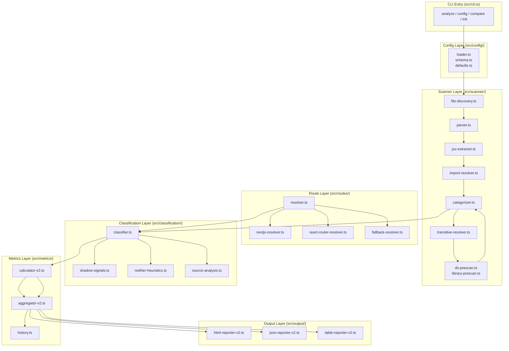

# DS Adoption Scanner — Comprehensive Technical & Business Analysis

## Project Overview

**DS Adoption Scanner** is a CLI tool and programmatic API that measures design-system adoption across React/TypeScript codebases. It parses ASTs to extract JSX usage, resolves imports, categorizes components structurally, and classifies them into analytical buckets (Adoption / Shadow / Neither). The primary users are **design-system teams** and **frontend platform engineers** who need data-driven insights to prioritize migration efforts, detect parallel local UI layers, and justify investment in design-system infrastructure.

---

## Technology Inventory

| Layer | Technology | Version | Responsibility |
|-------|-----------|---------|----------------|
| Runtime | Node.js | >= 18 | Execution environment |
| Language | TypeScript | ^5.4.0 | Source language, type safety |
| Build | tsup | ^8.0.0 | ESM + CJS bundling |
| AST Parsing | `@typescript-eslint/typescript-estree` | ^8.0.0 | JSX + TS AST extraction |
| Testing | vitest | ^1.6.0 | Unit + integration tests |
| Linting | eslint | ^10.2.0 | Code quality |
| Config Loading | jiti | ^2.4.0 | Runtime TS config import |
| File Crawling | fdir | ^6.4.0 | Fast directory traversal |
| Pattern Matching | picomatch | ^4.0.2 | Glob matching for includes/excludes |
| CLI Framework | commander | ^12.0.0 | CLI commands and options |
| Terminal UI | chalk, cli-table3, ora | various | Colored output, tables, spinners |

---

## Architecture Diagram



---

## Data Model

### Core Entities

| Entity | Key Fields | Relationships |
|--------|-----------|---------------|
| **DesignSystemDef** | `name`, `packages[]`, `path?`, `git?` | 1:N with ComponentFamily (via DSCatalog) |
| **ComponentFamily** | `name`, `components[]`, `files[]` | Belongs to one DS |
| **JSXUsageRecord** | `componentName`, `localName`, `importEntry`, `filePath`, `line`, `props[]` | Transforms into CategorizedUsage |
| **CategorizedUsage** | `category`, `dsName`, `packageName`, `resolvedPath`, `transitiveDS?` | Input to ClassifiedUsage |
| **ClassifiedUsage** | `analyticalBucket`, `classificationSource`, `classificationConfidence`, `shadowSignals?`, `routeId?` | Aggregated into metrics |
| **LocalComponentProfile** | `componentName`, `resolvedPath`, `fileCount`, `routeCount`, `signals[]`, `analyticalBucket` | Derived from local usages |
| **RouteMetrics** | `routeId`, `confidence`, `buckets`, `directAdoption`, `effectiveAdoptionProxy`, `shadowUsageProxy` | Per-route aggregation |

### Critical Classification Fields

- **`analyticalBucket`**: `'adoption' | 'shadow' | 'neither'` — mutually exclusive
- **`classificationSource`**: provenance of the decision (`direct-ds`, `transitive-declared`, `transitive-auto`, `local-ui-signal`, `utility-heuristic`, `unclassified`)
- **`transitiveDS.coverage`**: float 0.0–1.0, used as a weight in Effective Adoption Proxy

---

## Business Logic Specification

### Formulas & Algorithms

#### 1. Direct Adoption
```
Name: Direct Adoption
Formula: DirectAdoption = DirectDSInstances / (AdoptionInstances + ShadowInstances) * 100
Location: src/metrics/calculator-v2.ts:59-70
Business Context: Reliable lower-bound metric showing exact DS usage
Edge Cases: Returns 0 when denominator is 0 (no classified UI components)
```

#### 2. Effective Adoption Proxy
```
Name: Effective Adoption Proxy
Formula: EffectiveAdoption = (DirectDSInstances + sum(TransitiveInstance_i * Coverage_i)) / (AdoptionInstances + ShadowInstances) * 100
Location: src/metrics/calculator-v2.ts:72-106
Business Context: Includes DS-backed local libraries and wrappers to give credit for indirect adoption
Edge Cases: Weighted transitive uses transitiveDS.coverage (0.0–1.0). If coverage is missing, defaults to 0.
```

#### 3. Shadow Usage Proxy
```
Name: Shadow Usage Proxy
Formula: ShadowUsage = ShadowInstances / (AdoptionInstances + ShadowInstances) * 100
Location: src/metrics/calculator-v2.ts:108-122
Business Context: Detects parallel local UI layers that compete with the DS
Edge Cases: Neither bucket is intentionally excluded from denominator
```

#### 4. Two-Denominator Model
```
Name: Bucket Breakdown Percentages
Formula: Bucket% = BucketInstances / (Adoption + Shadow + Neither) * 100
Location: src/metrics/calculator-v2.ts:124-129
Business Context: Used for stacked-bar visualizations in HTML report
Edge Cases: Percentages sum to 100% (checked by invariant bucket-percentages-sum)
```

#### 5. Shadow Score
```
Name: Shadow Signal Score
Formula: Score = min(100, (sum(weight(strength_s)) / 18) * 100)
where weight(strong)=3, weight(moderate)=2, weight(weak)=1
Location: src/classification/shadow-signals.ts:293-309
Business Context: Prioritizes shadow candidates for remediation
Edge Cases: Max theoretical weight = 6 signals * 3 = 18
```

### Reporting Engine

| Report | Trigger | Data Sources | Aggregation Method | Business Purpose |
|--------|---------|--------------|-------------------|------------------|
| **V2 HTML Dashboard** | `analyze` command with `--model v2` | ClassifiedUsages, RouteMetrics, LocalComponentProfiles | Cross-repo aggregation via `aggregator-v2.ts` | Interactive drill-down for DS teams |
| **V2 JSON Report** | `analyze` command | Same as above | Same | CI integration, historical comparison |
| **Route Heatmap** | Embedded in HTML report | RouteMetrics per repo | Sorted by direct adoption ascending | Identify worst-adoption routes quickly |
| **History Manifest** | `--save-history` flag | Previous scan JSONs | Delta calculation in `history.ts` | Track adoption trends over time |

### Business Rules Catalog

- **Rule**: HTML-native elements are excluded from all metrics
  - **Condition**: `componentName` starts with lowercase (e.g., `<div>`, `<span>`)
  - **Action**: Categorized as `html-native`, bucket `neither`
  - **Implementation**: `src/scanner/categorizer.ts:13-23`
  - **Impact**: Prevents DOM primitives from diluting adoption rates

- **Rule**: Transitive adoption must not be overridden by shadow/neither classification
  - **Condition**: `category === 'local-library' && analyticalBucket === 'adoption' && source in {transitive-declared, transitive-auto}`
  - **Action**: Skip second-pass classification
  - **Implementation**: `src/classification/classifier.ts:73-82`
  - **Impact**: Preserves accurate credit for DS-backed wrappers

- **Rule**: Unmapped routes must be visible in warnings
  - **Condition**: `unmappedFiles > 0`
  - **Action**: Inject warning into `summary.routeCoverage.warnings`
  - **Implementation**: `src/metrics/aggregator-v2.ts:491-493`
  - **Impact**: Transparency when route resolution fails

- **Rule**: DS source repositories are excluded from `byRepository` report
  - **Condition**: `repoPath` matches any `designSystems[].path`
  - **Action**: Filter out before aggregation
  - **Implementation**: `src/metrics/aggregator-v2.ts:32-47`
  - **Impact**: Prevents scanning the design system itself as a consumer

- **Rule**: Third-party without DS backing defaults to `neither` (configurable to `shadow`)
  - **Condition**: `category === 'third-party' && !transitiveDS`
  - **Action**: Assign bucket based on `thirdPartyWithoutDSBucket` config
  - **Implementation**: `src/classification/classifier.ts:123-132`
  - **Impact**: Avoids penalizing adoption for unrelated npm packages

- **Rule**: Barrel file re-exports are followed recursively for transitive detection
  - **Condition**: `local-library` component source has no direct DS import
  - **Action**: Parse `ExportNamedDeclaration` / `ExportAllDeclaration` and recurse
  - **Implementation**: `src/scanner/transitive-resolver.ts:229-239`
  - **Impact**: Handles `src/ui-kit/index.ts` -> `./Button.tsx` patterns correctly

---

## Configuration Analysis

### Business-Critical Constants (from `src/domain/constants.ts`)

| Constant | Value | Business Impact |
|----------|-------|-----------------|
| `REUSABLE_FILE_THRESHOLD` | 2 | Minimum files for `reusable-local` shadow signal |
| `MULTI_ROUTE_THRESHOLD` | 2 | Minimum routes for `multi-route` shadow signal |
| `SUBSTANTIAL_MARKUP_THRESHOLD` | 5 | Minimum JSX elements for `substantial-markup` signal |
| `UTILITY_MARKUP_THRESHOLD` | 2 | Maximum JSX elements for utility-like components |

### Configurable Thresholds (from `src/config/schema.ts` -> `src/config/loader.ts`)

| Config Path | Default | Behavior |
|-------------|---------|----------|
| `v2.classification.thresholds.reusableFileThreshold` | 2 | Files needed for reusable-local signal |
| `v2.classification.thresholds.shadowFileThreshold` | 2 | Files needed for multi-file shadow signal |
| `v2.classification.thresholds.shadowRouteThreshold` | 2 | Routes needed for multi-route shadow signal |
| `v2.classification.thresholds.substantialMarkupThreshold` | 5 | JSX count for substantial-markup signal |
| `reusableThreshold` | 2 | V1: local components used in >=2 files are "reusable" |
| `excludeLocalFromAdoption` | `false` | Removes all `local` from adoption denominator |
| `excludeUniqueLocalFromAdoption` | `true` (via defaults) | Removes singleton local components from denominator |

### Feature Flags

| Flag | Default | Effect |
|------|---------|--------|
| `v2.enabled` | `true` | Switches to deterministic analytical model |
| `v2.routeResolution.enabled` | `true` | Enables Next.js / React Router / fallback resolvers |
| `v2.classification.shadowDetection` | `true` | Enables shadow signal detection |
| `v2.classification.neitherDetection` | `true` | Enables utility/business wrapper heuristics |
| `v2.invariants.enabled` | `true` | Runs invariant checks on final report |
| `v2.invariants.failOnViolation` | `false` | Throws error if invariants fail |

---

## Code Quality & Risks

### Hardcoded Business Values

| Value | Location | Risk |
|-------|----------|------|
| Adoption color thresholds (`>=70%` ok, `>=40%` warn) | `src/output/html-reporter-v2.ts:21-28` | Hardcoded product thresholds; not configurable |
| Shadow color thresholds (`>=30%` bad, `>=15%` warn) | `src/output/html-reporter-v2.ts:24-26` | Same as above |
| Heatmap style breakpoints (`70, 50, 30`) | `src/output/html-reporter-v2.ts:51-56` | Visual thresholds diverge from metric thresholds |

### Missing Validation Gaps

1. **Floating-point precision in financial-like metrics**: The code uses standard JavaScript `number` arithmetic for percentages. While not financial currency, the `effectiveAdoptionProxy` aggregates weighted floats (`coverage` 0.0–1.0). No explicit rounding strategy beyond `toFixed(1)` in reporters. Risk: tiny epsilon drift in invariant checks (`checkDirectLTEffective` allows `+0.01` as a workaround at `src/domain/invariants.ts:80`).
2. **No timezone handling**: Timestamps are generated with `new Date().toISOString()` (UTC). No fiscal calendar or timezone configuration exists.

### Circular Dependencies / Structural Risks

- **Cross-library propagation loop** (`src/scanner/library-prescan.ts:104-172`): Uses a `while (changed && iterations < 10)` fixed-point iteration. Convergence is bounded but not proven for all inputs.
- **Recursive re-export resolution** (`src/scanner/transitive-resolver.ts:202-246` and `src/scanner/library-prescan.ts:645-710`): Protected by `visited` sets and early cache insertion, but deep barrel chains could still hit stack limits.

### TODOs / FIXMEs / Notable Comments

The codebase is notably clean of `TODO`/`FIXME` markers. The only diagnostic conditionals are `process.env.DS_SCANNER_DEBUG` logs in route resolvers (`src/routes/resolver.ts`, `src/routes/react-router-resolver.ts`), which are benign runtime debug flags.

### Caching Strategies

- **Import resolution cache**: `ImportResolver.cache` (per-repo, keyed by `source::containingFile`) — `src/scanner/import-resolver.ts:47-56`
- **Transitive detection cache**: `Map<string, TransitiveDetection | null>` passed per-repo — `src/scanner/transitive-resolver.ts:38`
- **Component source analysis cache**: `analysisCache` in `src/classification/source-analysis.ts:21` — global singleton, cleared in tests via `clearComponentSourceAnalysisCache()`
- **Module resolution cache**: `ts.createModuleResolutionCache` in `ImportResolver` — `src/scanner/import-resolver.ts:17-21`

**Risk**: The `analysisCache` is a module-level singleton. In long-running processes (programmatic API), stale file contents will produce incorrect shadow/neither signals if source files change between scans. There is no cache invalidation by file mtime.

### Temporal Dependencies

- **Scan duration**: `Date.now()` delta used for `scanDurationMs` — no timezone concerns.
- **History manifest**: Timestamps stored as ISO strings; comparison is simple string subtraction for deltas.
- **No cron/scheduler**: The tool is purely on-demand; no background jobs or archival logic beyond history JSON writing.

### Precision Issues

- **Metric denominator**: The invariant `no-double-counting` intentionally passes `0` for neither instances (`src/domain/invariants.ts:220-227`). This is correct by design but easy to misuse if a developer modifies the call site.
- **Route confidence propagation**: Downgrades by one level per import hop (`high -> medium -> low`). This is a discrete ordinal system with no fractional confidence — acceptable for the use case but coarse-grained.
